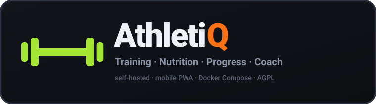

<div align="center">



**Dein selbst gehosteter Tracker für Training, Ernährung und Fortschritt.**

[](https://github.com/Kingdaniel4747/Athletiq/actions/workflows/test.yml)
[](docker-compose.yml)
[](LICENSE)

</div>

# AthletiQ

AthletiQ verbindet zwei klar getrennte Bereiche in einer mobilen Web-App:

- **Gym** (grün): Trainingspläne, geführte Workouts, progressive Überlastung,
  Körpergewicht, Muskelbelastung, Statistiken und Trainingshistorie.
- **Health** (orange): Kalorien, Makros, Protein, Mahlzeiten, Wasser,
  Barcode-Suche, Mealie-Rezepte, Gewichtstrend und Coach-Auswertung.

Der Coach bewertet Training und Ernährung gemeinsam über eine Ampel. Er erkennt
unter anderem Stagnation, fehlende Trainingskonstanz, Protein- und Kalorienabweichungen
sowie den Gewichtstrend. Optional kann ein eigener KI-Endpunkt daraus konkrete
Vorschläge für Kalorien, Makros und Trainingspläne erzeugen. Änderungen werden erst
nach deiner Bestätigung übernommen.

## Schnellstart mit nur Docker Compose

Du brauchst lediglich Docker mit Compose. Lade die eine Compose-Datei herunter und
starte sie:

```bash
mkdir athletiq && cd athletiq
curl -fsSLO https://raw.githubusercontent.com/Kingdaniel4747/Athletiq/main/docker-compose.yml
docker compose up -d
```

Öffne danach **http://localhost:8080**. Fertige Images für AMD64 und ARM64 werden
automatisch aus der GitHub Container Registry geladen. Beim ersten Start werden die
Übungsbilder einmalig in `./media` geladen; Benutzerdaten bleiben in `./data`.

Für Updates genügt:

```bash
docker compose pull
docker compose up -d
```

> Die beiden GHCR-Pakete `athletiq-api` und `athletiq-web` müssen im GitHub-Repository
> einmalig auf **Public** gestellt werden, damit der Schnellstart ohne Anmeldung klappt.

## Funktionen

### Gym

- Wochenplan, freie Workouts und geführter Trainingsmodus
- Trainingsgewichte aus der letzten Einheit und mehrere Progressionsregeln
- Progressive-Overload-Auswertung, PRs und geschätztes 1RM
- Warm-up-Sätze, Supersätze, RIR/RPE, Cardio und zeitbasierte Übungen
- Körpergewicht, Zielgewicht, Heatmap, Muskelbalance und Ermüdungsansicht
- Passkey-Profile, geräteübergreifender Sync und Gastmodus
- Import von FitNotes, Strong, Hevy und Apple-Health-Exporten

### Health

- Tagesziele für Kalorien, Protein, Kohlenhydrate und Fett
- Mahlzeiten und eigene Lebensmittel mit frei wählbarer Portionsmenge
- Barcode-Suche über Open Food Facts
- Rezeptimport aus einer eigenen Mealie-Instanz
- Wasserziel mit animierter Flasche und schneller Mengenwahl
- Gewichtstrend und gemeinsame Ampel für Ernährung und Training
- Regelbasierter Coach, der auch ohne externen KI-Dienst funktioniert
- Optionaler KI-Coach über einen OpenAI-kompatiblen Chat-Completions-Endpunkt

## Optionale Konfiguration

Der erste Start benötigt keine `.env`. Kopiere [.env.example](.env.example), wenn du
Domain, Port, Accounts oder Integrationen anpassen möchtest:

```bash
cp .env.example .env
docker compose up -d
```

Wichtigste Werte:

| Variable | Zweck |
| --- | --- |
| `RP_ID` | Exakter Hostname für Passkeys, ohne Protokoll |
| `ORIGIN` | Öffentliche HTTPS-Adresse der App |
| `WEB_PORT` | Veröffentlichter Port, standardmäßig `8080` |
| `ALLOW_GUEST` | Gastmodus mit `1` erlauben oder mit `0` abschalten |
| `MEALIE_URL` | Basis-URL deiner Mealie-Instanz |
| `MEALIE_API_TOKEN` | Server-seitiger Mealie-Token |
| `AI_API_URL` | Chat-Completions-kompatibler KI-Endpunkt |
| `AI_MODEL` | Modellname des Endpunkts |
| `AI_API_KEY` | Optionaler API-Schlüssel; bleibt im API-Container |

Open Food Facts funktioniert ohne Zugangsdaten. Für Kamera-Barcode-Scanning,
Passkeys, Installation als PWA und Push-Nachrichten solltest du außerhalb von
`localhost` immer HTTPS verwenden. Die vollständige Server-Anleitung steht in
[docs/SELF_HOSTING.md](docs/SELF_HOSTING.md), die Integrationen in
[docs/HEALTH_AND_COACH.md](docs/HEALTH_AND_COACH.md).

## Daten und Datenschutz

- AthletiQ enthält keine Telemetrie und kein Werbe-Tracking.
- Profile und Zustände liegen im gemounteten Ordner `./data`.
- Übungsmedien liegen in `./media` und können jederzeit neu geladen werden.
- Mealie- und KI-Schlüssel werden nur vom Backend verwendet und nicht an den Browser
  ausgeliefert.
- Vor Updates sollte mindestens `./data` gesichert werden.

Der Coach ist ein Planungswerkzeug und kein Ersatz für medizinische Beratung. Bei
Krankheiten, Essstörungen, Schwangerschaft oder ungewöhnlichen Beschwerden gehören
Zielwerte und Trainingsänderungen in professionelle Hände.

## Entwicklung

Voraussetzungen: Node.js 22 und npm.

```bash
cd frontend
npm ci
npm test
npm run build
```

API-Prüfung:

```bash
node --check api/server.js
```

Der GitHub-Workflow [docker-publish.yml](.github/workflows/docker-publish.yml) baut bei
Pushes auf `main` und bei Releases automatisch die beiden Multi-Arch-Images. Der
[Test-Workflow](.github/workflows/test.yml) prüft Frontend, API, Übersetzungen, Build
und Compose-Konfiguration.

## Lizenz und Herkunft

AthletiQ steht unter der **GNU AGPL v3.0 oder neuer**. Die Lizenz darf bei einer
Weiterverteilung nicht entfernt oder durch eine proprietäre Lizenz ersetzt werden.
Rechtlich notwendige Herkunfts- und Drittanbieterhinweise stehen in
[NOTICE.md](NOTICE.md). Die Übungsbilder und Animationen sind Drittinhalte und werden
nicht durch die AGPL dieses Repositorys lizenziert.

